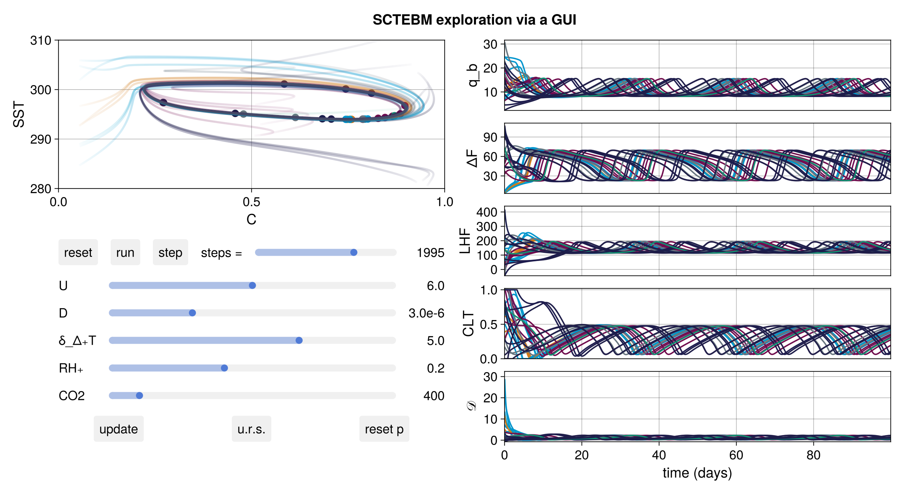

# Sensitivity of stratocumulus--cumulus transitions in a cloudy energy balance model



This code base is using the Julia Language and [DrWatson](https://juliadynamics.github.io/DrWatson.jl/stable/)
to make a reproducible scientific codebase accompanying the paper

> Sensitivity of stratocumulus--cumulus transitions in a cloudy energy balance model

The codebase creates the "SCTEBM" (Stratocumulus Cumulus Transition Energy Balance Model) and defines and runs all analysis for it, as well as for observational data.
It also offers several exploratory scripts that allow playing around with the model
with a GUI like the one above.

It is authored by George Datseris.

To (locally) reproduce this project, do the following:

1. Download this codebase as is and unzip it to some folder.
2. Open a Julia console and do:
   ```
   julia> using Pkg
   julia> Pkg.activate("path/to/this/project/folder")
   julia> Pkg.instantiate()
   ```

This will install all necessary packages for you to be able to run the scripts and
everything should work out of the box.

If you attempted to reproduce something from this codebase but failed, open a GitHub Issue in this repository describing the problem and I'll have a look. I've exported this codebase from a larger project and may have forgotten to copy something over!

# Codebase structure

## `CloudToppedMixedLayerModel` submodule

The codebase utilizes heavily the following:

- [DynamicalSystems.jl](https://juliadynamics.github.io/DynamicalSystemsDocs.jl/dynamicalsystems/dev/)
- ConceptualClimateModels.jl and in particular the submodule [CloudToppedMixedLayerModels](https://juliadynamics.github.io/ConceptualClimateModels.jl/stable/submodules/ctmlm/).

If you want to engage meaningfully with expanding the SCTEBM you probably want
to read those documentation pages first. The most relevant pages are:
- The DynamicalSystems.jl [overarching tutorial](https://juliadynamics.github.io/DynamicalSystemsDocs.jl/dynamicalsystems/dev/tutorial/)
- The ConceptualClimateModels.jl [tutorial](https://juliadynamics.github.io/ConceptualClimateModels.jl/dev/)
- The [examples](https://juliadynamics.github.io/ConceptualClimateModels.jl/dev/examples/ctmlm/) for using mixed layer models and adding clouds.

## SCTEBM Variants

The whole codebase revolves around the function `ctmlm_setup`
which you can find in the `src/ctmlm_setups.jl` file.
The function takes as an input a dictionary, mapping model aspect
to its option, and creates the SCTEBM variant while filling in all other
equations with their default version.

The only difference with the paper here is that the options are named with `Symbol`s
instead of being enumerated with 1, 2, 3.

## Important folders and files

- `src`: source folder defining functions to simulate and analyze SCTEBMs
  - Crucially, the actual equations to create an SCTEBM are not in this codebase. They have been moved into the submodule [CloudToppedMixedLayerModels](link_here) that has a dedicated documentation and tutorial. `ctmlm_setups` just calls this module using the options listed on the Table 1 of the paper, §2.7.
- `scripts`: all scripts that when run will re-create every single simulation
  and plot used in the paper.
  - The two files in the folder `exploration` create a GUI application that allows changing parameters via sliders. They also allow visualizing any kind of observable and they allow using any variant of the SCTEBM, or directly adding or removing equations. **These files are the best place to start using this codebase**.
  - The `sensitivity` folder contains all scripts related to the sensitivity to environmental conditions and parameterizations.
  - The `continuation` folder contains all scripts for the climate change simulations. Particularly relevant are the `generation.jl` and `analysis.jl` scripts that allow simulating and then visualizing any observable during a climate change simulation, §3.5.
- `data`: an empty folder that does not exist on GitHub, but would contain the
  output of all simulations and downloaded observational data. Happy to share my
  folder if you contact me so that you don't have to re-run all simulations
  or find all the observational data.
- `plots`: also empty folder that will have all plots that the `scripts` create. Some scripts save directly to a `papers/figures` folder.
